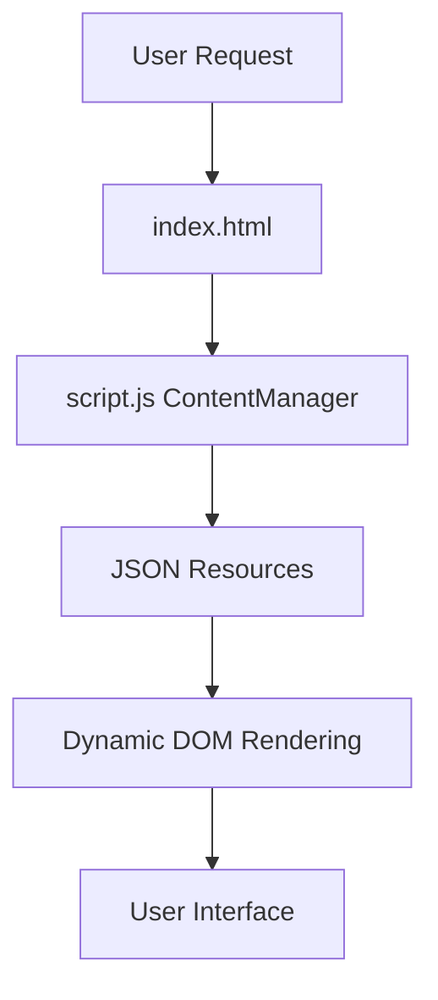
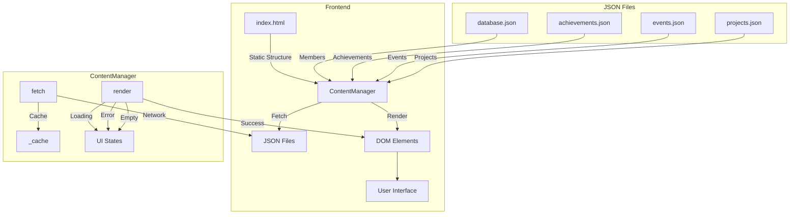
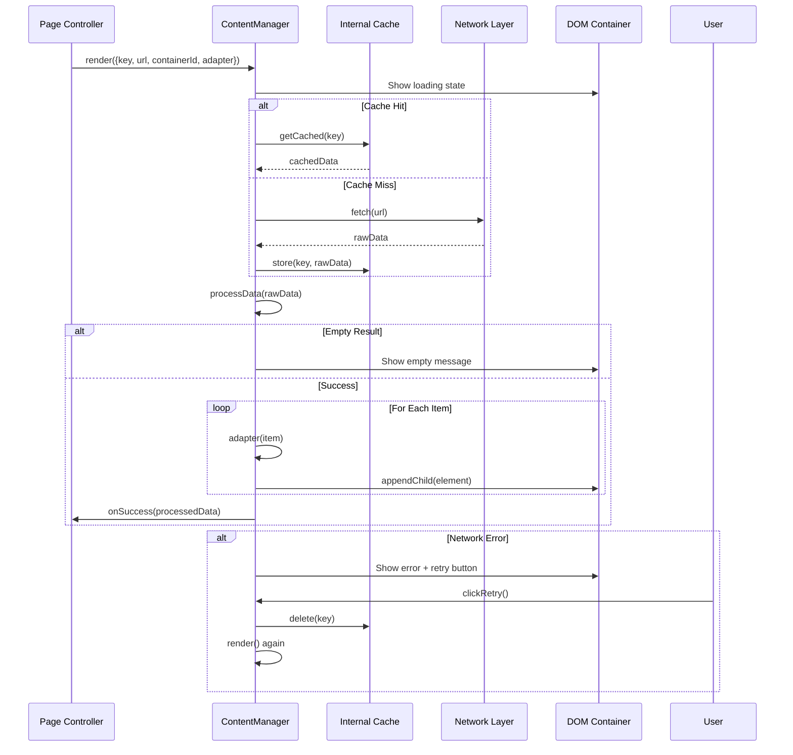
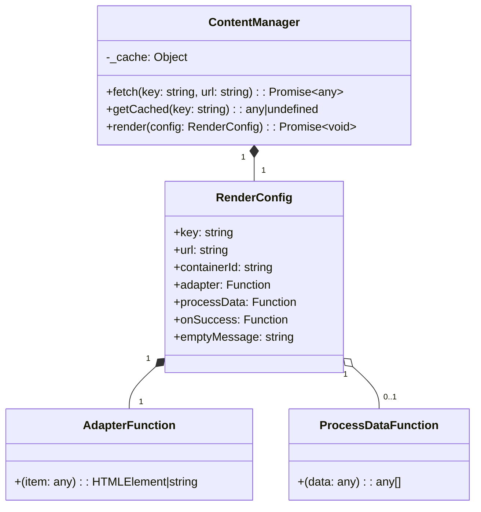
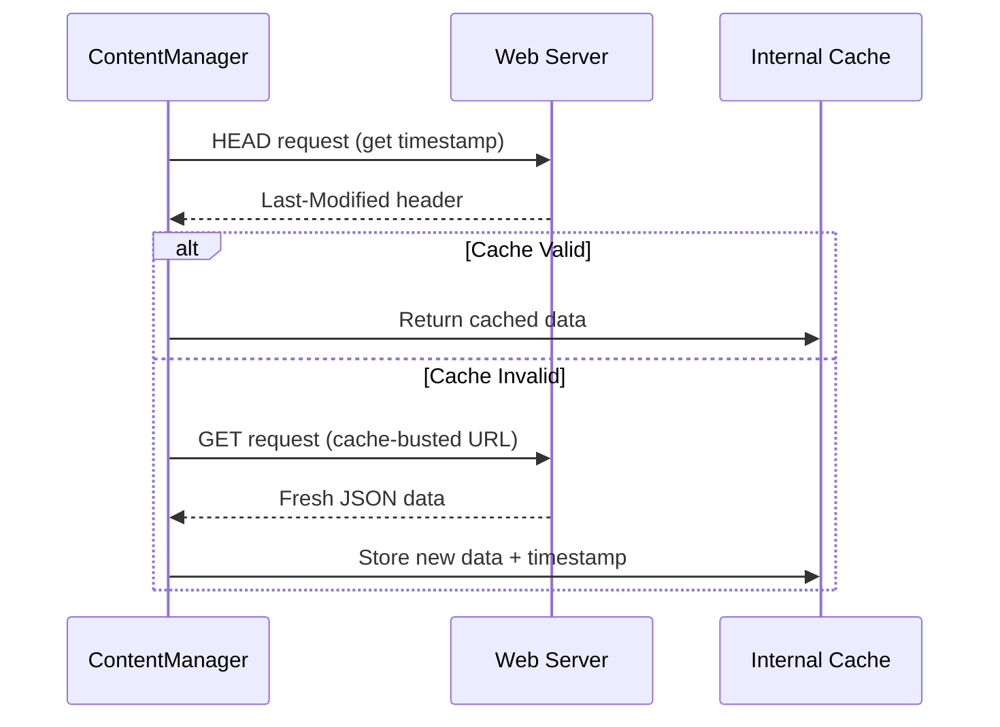
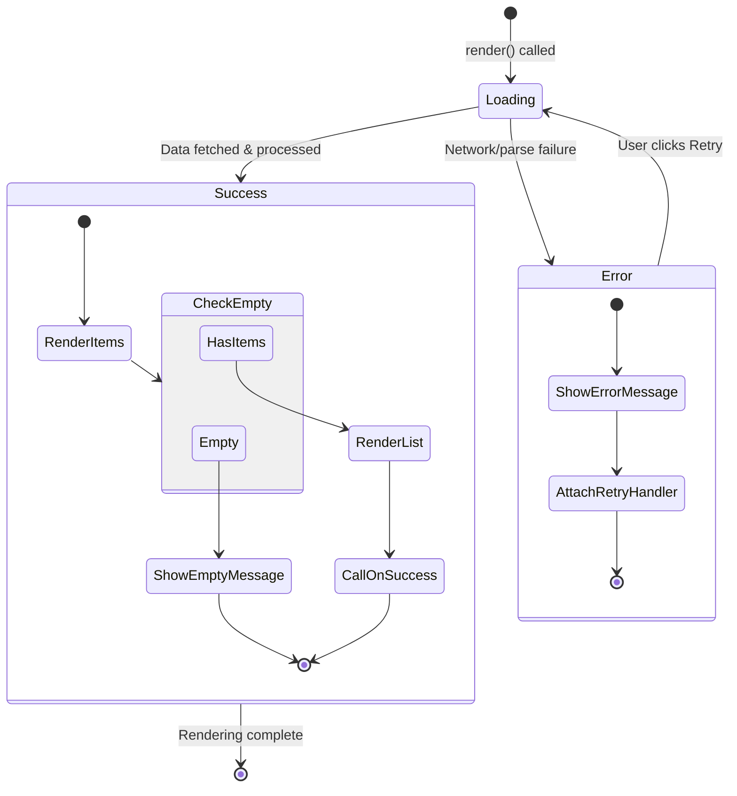
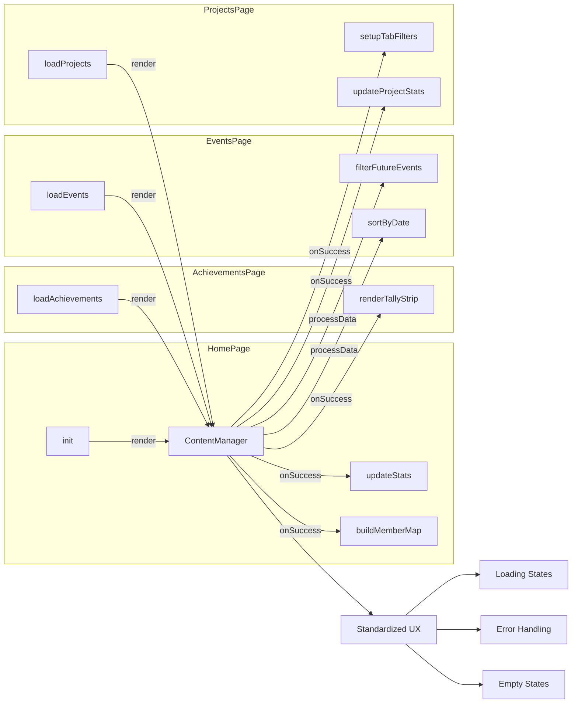

# Architecture Overview

This document describes the architecture of the Statistics Programming Club website, focusing on the **Content Delivery & Render Engine** introduced to improve maintainability, testability, and locality.

> **Note**: This file was created for AI agents to help them understand the project's architecture, making future AI-driven maintenance easier. If you are a human reader, it is recommended to use an AI assistant to help you explore and understand the project. <br>
> **// Naim**

## System Components

### High-Level Flow



### Detailed Component Diagram



## Content Delivery & Render Engine (ContentManager)

### ContentManager Workflow



### Purpose

The `ContentManager` is a deep module that centralizes:
- **Network data fetching** from JSON endpoints
- **In-memory caching** to avoid duplicate network requests
- **Unified UI state management** (loading, error, retry, empty states)
- **Dynamic template rendering** using pluggable adapters

### Interface



#### Interface Signature

```javascript
const ContentManager = {
  // Fetch and cache data
  async fetch(key, url): Promise<any>

  // Get cached data synchronously
  getCached(key): any | undefined

  // Render a complete section with standardized UX
  async render({
    key: string,
    url: string,
    containerId: string,
    adapter: (item) => HTMLElement | string,
    processData?: (data) => any[],
    onSuccess?: (processedData) => void,
    emptyMessage?: string
  }): Promise<void>
}
```

### Key Features

#### 1. Smart Caching with Cache-Busting
- **Automatic cache invalidation** using file timestamps
- **Real-time updates** - editors see changes immediately
- **Development mode** - cache invalidated on each page load
- **Production mode** - uses Last-Modified headers for efficient caching

**Cache Invalidation Flow:**



#### 2. Manual Refresh Capabilities
- **`refresh(key, url)`** - Invalidate and re-fetch specific cache entry
- **`clearCache()`** - Clear entire cache
- **UI Refresh Button** - One-click cache clearing in sidebar
- **Retry Buttons** - Per-section refresh on errors

#### 2. Standardized UI States

**State Transition Diagram:**



**Loading State:**
```html
<div class="content-loading">
  <span class="tcur"></span> // Loading dynamic content...
</div>
```

#### 2. Standardized UI States

**Loading State:**
```html
<div class="content-loading">
  <span class="tcur"></span> // Loading dynamic content...
</div>
```

**Error State (with Retry):**
```html
<div class="content-error">
  <div>// Error: Failed to load {key}. Check network connection.</div>
  <button class="retry-btn">Retry ↻</button>
</div>
```

**Empty State:**
```html
<div>// No items found.</div>
```

#### 3. Pluggable Rendering
- `adapter` function transforms raw data items into DOM elements
- Supports both HTMLElement and HTML string returns
- Allows complete customization of visual presentation per section

#### 4. Data Processing Pipeline
- `processData` callback enables filtering, sorting, and transformation
- Runs after fetching but before rendering
- Used for:
  - Filtering past events
  - Sorting projects by featured status
  - Extracting specific data subsets

### Usage Patterns

#### Pattern 1: Simple Data Fetch + Render
```javascript
await ContentManager.render({
  key: 'achievements',
  url: 'resources/data/achievements.json',
  containerId: 'ach-grid',
  processData: (data) => data.achievements,
  adapter: (item) => createAchievementCard(item)
});
```

#### Pattern 2: Data Fetch + Custom Post-Processing
```javascript
await ContentManager.render({
  key: 'events',
  url: 'resources/data/events.json',
  containerId: 'events-list',
  processData: (data) => {
    return data.events
      .sort((a, b) => new Date(a.date) - new Date(b.date))
      .filter(ev => !isPastEvent(ev));
  },
  adapter: (event) => createEventRow(event),
  onSuccess: () => setupEventListeners()
});
```

#### Pattern 3: Data Query Without Rendering
```javascript
// For home page statistics that need cached data
const projects = ContentManager.getCached('projects');
const activeCount = projects.filter(p => p.status === 'active').length;
```

## Page-Specific Integration

### Integration Pattern Across Pages



### Home Page & Member Sections
- **Database fetching**: Unified through `ContentManager.render()`
- **Member map population**: Handled in `onSuccess` callback for modal functionality
- **Statistics calculation**: Uses cached data from `getCached()`

### Achievements Page
- **Tally strip**: Rendered in `onSuccess` callback after achievements load
- **Achievement cards**: Standard adapter-based rendering

### Events Page
- **Future event filtering**: Implemented in `processData` callback
- **Date sorting**: Handled before rendering
- **Registration links**: Embedded in adapter output

### Projects Page
- **Tab filtering**: Uses cached data with client-side filtering
- **Featured sorting**: Implemented in `processData`
- **Statistics updates**: Home page counters updated via `onSuccess`

## Benefits of This Architecture

### 1. Locality
- All network logic concentrated in one module
- Error handling standardized and reusable
- No scattered try-catch blocks across the codebase

### 2. Leverage
- Adding new content sections requires minimal code
- Consistent user experience across all dynamic sections
- Single point for performance optimizations (caching, retry logic)

### 3. Testability
- Clear seam between data fetching and UI rendering
- Easy to mock network responses for testing
- Error states testable without complex setup

### 4. Maintainability
- Changes to loading/error UI affect all sections automatically
- New data sources integrate with consistent pattern
- Debugging centralized in one module

## Design Decisions

### Why a Hybrid Manager?
We chose the **Hybrid Content Manager** pattern (data fetching + rendering) over alternatives:

- **Declarative Registration**: Too rigid for sections with complex custom states
- **Data-First Service**: Wouldn't solve UI duplication (loading spinners, error messages)

The hybrid approach provides:
- Standardized rendering for 80% of use cases
- Escape hatches (`onSuccess`, direct cache access) for 20% of custom needs

### Why In-Memory Cache?
- Simple and effective for this use case
- No external dependencies
- Automatic garbage collection when page unloads
- Sufficient for the scale of this application

### Why Pluggable Adapters?
- Allows each section to maintain its unique visual identity
- No need for complex templating language
- Pure functions are easy to test and reason about
- Flexible enough for both simple and complex layouts

## Known Limitations

1. **Offline Support**: No persistent caching (IndexedDB) - cache is memory-only
2. **SSG/SSR**: Not designed for static site generation - requires client-side JavaScript
3. **Complex State**: Sections with intricate state machines may need custom logic
4. **HEAD Request Support**: Requires proper CORS headers for HEAD requests in production

## Resolved Issues

✅ **Cache Invalidation**: Now automatic via file timestamps
✅ **Real-time Updates**: Editors see changes immediately without page refresh
✅ **Development Workflow**: Cache automatically invalidated in dev mode
✅ **Manual Override**: Refresh button and API methods for manual cache clearing

## Future Enhancements

Potential improvements that could be added:

1. **Offline-first mode** with IndexedDB fallback for persistent caching
2. **Progressive loading** for large datasets (pagination/infinite scroll)
3. **Web Worker** support for heavy data processing
4. **TypeScript migration** for better type safety
5. **Service Worker** for offline caching and background sync
6. **WebSocket integration** for real-time updates without polling

## Testing Strategy

### Unit Testing
- Mock `window.fetch` to test `ContentManager.fetch()`
- Test error handling with rejected promises
- Verify retry mechanism clears cache

### Integration Testing
- Verify all sections render correctly
- Test error states by breaking JSON files
- Verify retry buttons restore content

### End-to-End Testing
- Navigate through all pages
- Verify statistics update correctly
- Test tab filtering on projects page
- Verify modal windows work with new data structure

## Migration Guide (for future maintainers)

### Adding a New Content Section

1. **Create JSON file** in `resources/`
2. **Add rendering call** in appropriate lifecycle hook:
   ```javascript
   await ContentManager.render({
     key: 'new-section',
     url: 'resources/data/new-section.json',
     containerId: 'new-container',
     adapter: (item) => createCustomElement(item)
   });
   ```
3. **Create adapter function** to transform items to DOM
4. **Add to navigation** if needed

### Modifying Existing Section

1. **Update adapter function** for visual changes
2. **Modify processData** for data transformation changes
3. **Adjust onSuccess** for side effects
4. **JSON schema changes** automatically reflected

## Conclusion

The ContentManager architecture provides a clean separation of concerns while maintaining flexibility. It significantly reduces code duplication and makes the codebase more maintainable and testable. The hybrid approach balances standardization with customization needs, making it suitable for both simple and complex content sections.