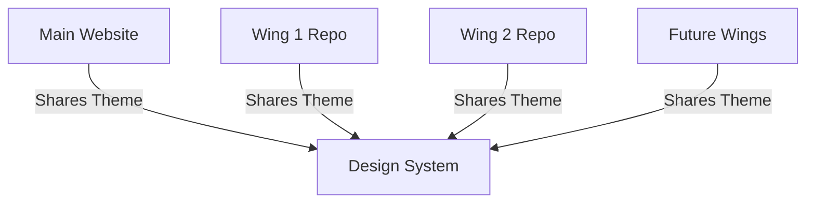

# PCStat Design System

**Name**: pcstat-design-system
**Description**: Ensures visual consistency across all Statistics Programming Club website wings and repositories. Use this skill whenever creating new pages, sections, or standalone repositories that need to maintain the club's visual identity. The skill generates theme files, UI components, and integration guides to guarantee all parts of the ecosystem look like they belong to the same project.

## Core Principles

1. **Visual Unity** - All wings must appear as one cohesive website
2. **Modular Development** - Each wing can have independent architecture
3. **Consistent Experience** - Users shouldn't notice when crossing repository boundaries
4. **Easy Integration** - Simple adoption for new developers

## System Architecture



## Theme System

### CSS Variables (Required)
All repositories must include these CSS variables in their root element:

```css
:root {
  /* Colors */
  --bg: #0a0a0a;           /* Background */
  --fg: #e0e0e0;           /* Foreground */
  --ac: #00d4aa;           /* Accent */
  --mut: #555;            /* Muted text */
  
  /* Typography */
  --fm: 'Fira Code', 'Courier New', monospace;  /* Font Mono */
  --fs: 'Inter', sans-serif;                   /* Font Sans */
  
  /* Spacing */
  --gap: 1rem;
  --pad: 1.5rem;
  --rad: 4px;
}

[data-theme="light"] {
  --bg: #ffffff;
  --fg: #111111;
  --ac: #00a884;
  --mut: #666666;
}
```

### Theme Toggle Integration
```javascript
// Required theme initialization
function initTheme() {
  const savedTheme = localStorage.getItem('theme') || 'dark';
  document.documentElement.setAttribute('data-theme', savedTheme);
}

// Required theme toggle handler
document.getElementById('theme-toggle')?.addEventListener('click', () => {
  const current = document.documentElement.getAttribute('data-theme');
  const next = current === 'dark' ? 'light' : 'dark';
  document.documentElement.setAttribute('data-theme', next);
  localStorage.setItem('theme', next);
});
```

## Component Library

### 1. Navigation Bar
**Required HTML Structure:**
```html
<nav class="sb">
  <div class="sbh">
    <div class="sbb">
      <div class="lm">Statistics<span>.</span></div>
      <div class="ls">// Programming Club</div>
    </div>
  </div>
  <ul class="nis">
    <!-- Navigation items here -->
  </ul>
</nav>
```

**Required CSS Classes:**
```css
.sb { /* Sidebar container */ }
.sbh { /* Sidebar header */ }
.nis { /* Navigation items list */ }
.ni { /* Navigation item */ }
```

### 2. Card Components
**Standard Card Structure:**
```html
<div class="card">
  <div class="card-header">
    <h3>Title</h3>
    <span class="tag">Category</span>
  </div>
  <div class="card-body">
    <!-- Content -->
  </div>
  <div class="card-footer">
    <!-- Actions -->
  </div>
</div>
```

### 3. Button System
**Button Classes:**
```css
.btn { /* Base button */ }
.btn-primary { background: var(--ac); }
.btn-secondary { border: 1px solid var(--ac); }
```

## Integration Guide

### Quick Start for New Repositories

```bash
# 1. Copy theme files from main repository
cp /path/to/pcstat-main/{theme.css,theme.js} ./public/

# 2. Install in your project
# For HTML projects:
<link rel="stylesheet" href="public/theme.css">
<script src="public/theme.js" type="module"></script>

# For React/Vue projects:
import 'public/theme.css';
import { initTheme } from 'public/theme.js';

# 3. Initialize theme
document.addEventListener('DOMContentLoaded', () => {
  initTheme();
  // Optional: show theme validator for development
  if (process.env.NODE_ENV === 'development') {
    showThemeValidator();
  }
});
```

### Step-by-Step Integration

#### 1. Copy Theme Files
```bash
# From main repository
cp pcstat-main/theme.css your-project/public/theme.css
cp pcstat-main/theme.js your-project/public/theme.js
cp pcstat-main/PCSTAT_DESIGN_SYSTEM.md your-project/docs/
```

#### 2. Include in HTML
```html
<!DOCTYPE html>
<html>
<head>
  <!-- Required: Theme CSS -->
  <link rel="stylesheet" href="public/theme.css">
  
  <!-- Optional: Your project CSS (should come after theme.css) -->
  <link rel="stylesheet" href="styles.css">
</head>
<body>
  <!-- Your content -->
  
  <!-- Required: Theme JS -->
  <script src="public/theme.js" type="module"></script>
  
  <!-- Initialize theme -->
  <script>
    document.addEventListener('DOMContentLoaded', () => {
      initTheme();
      initThemeToggles();
    });
  </script>
</body>
</html>
```

#### 3. Add Theme Toggle
```html
<!-- Desktop toggle -->
<button id="theme-toggle" title="Toggle Theme">
  <div class="theme-switch"><div class="switch-thumb"></div></div>
</button>

<!-- Mobile toggle -->
<button id="theme-toggle-mob" title="Toggle Theme">
  <div class="theme-switch"><div class="switch-thumb"></div></div>
</button>
```

#### 4. Use Standard Components
```html
<!-- Card Component -->
<div class="card">
  <h3>Your Content</h3>
  <p>Card content goes here</p>
</div>

<!-- Button Component -->
<button class="btn">Primary Action</button>
<button class="btn btn-primary">Secondary Action</button>

<!-- Navigation Item -->
<div class="nav-item">
  <span class="nic">📄</span>
  <span class="nil">Page Name</span>
</div>
```

#### 5. Validate Theme (Development)
```javascript
// Add this to check theme consistency
import { validateTheme, showThemeValidator } from './theme.js';

// Run validation
if (!validateTheme()) {
  console.error('Theme validation failed! Check CSS variables.');
}

// Show visual validator badge (development only)
if (process.env.NODE_ENV === 'development') {
  showThemeValidator();
}
```

### Framework-Specific Integration

#### React Integration
```javascript
// theme.js (wrapper)
import { initTheme, toggleTheme } from './public/theme.js';

export const useTheme = () => {
  const [theme, setTheme] = useState(localStorage.getItem('theme') || 'dark');
  
  useEffect(() => {
    initTheme();
    const observer = new MutationObserver(() => {
      setTheme(document.documentElement.getAttribute('data-theme'));
    });
    observer.observe(document.documentElement, { attributes: true });
    return () => observer.disconnect();
  }, []);
  
  const toggle = () => {
    toggleTheme();
    setTheme(prev => prev === 'dark' ? 'light' : 'dark');
  };
  
  return { theme, toggle };
};

// Usage in component
function ThemeToggle() {
  const { theme, toggle } = useTheme();
  return (
    <button onClick={toggle}>
      {theme === 'dark' ? '🌙' : '☀️'}
    </button>
  );
}
```

#### Vue Integration
```javascript
// main.js
import { createApp } from 'vue';
import App from './App.vue';
import './public/theme.css';
import { initTheme } from './public/theme.js';

const app = createApp(App);
app.mount('#app');

// Initialize theme
document.addEventListener('DOMContentLoaded', initTheme);

// Theme composable
export function useTheme() {
  const theme = ref(localStorage.getItem('theme') || 'dark');
  
  const toggleTheme = () => {
    import('./public/theme.js').then(({ toggleTheme }) => {
      toggleTheme();
      theme.value = document.documentElement.getAttribute('data-theme');
    });
  };
  
  return { theme, toggleTheme };
}
```

#### Next.js Integration
```javascript
// _app.js
import '../public/theme.css';
import { initTheme } from '../public/theme.js';

function MyApp({ Component, pageProps }) {
  useEffect(() => {
    initTheme();
  }, []);
  
  return <Component {...pageProps} />;
}

// Theme context
const ThemeContext = createContext();

export function ThemeProvider({ children }) {
  const [theme, setTheme] = useState('dark');
  
  const toggleTheme = () => {
    import('../public/theme.js').then(({ toggleTheme }) => {
      toggleTheme();
      setTheme(document.documentElement.getAttribute('data-theme'));
    });
  };
  
  useEffect(() => {
    const observer = new MutationObserver(() => {
      setTheme(document.documentElement.getAttribute('data-theme'));
    });
    observer.observe(document.documentElement, { attributes: true });
    return () => observer.disconnect();
  }, []);
  
  return (
    <ThemeContext.Provider value={{ theme, toggleTheme }}>
      {children}
    </ThemeContext.Provider>
  );
}
```

## Visual Regression Testing

### Automated Test Suite

#### Puppeteer Test Example
```javascript
// test/theme-consistency.js
const puppeteer = require('puppeteer');
const assert = require('assert');

async function testThemeConsistency() {
  const browser = await puppeteer.launch();
  const page = await browser.newPage();
  
  console.log('Testing theme consistency across repositories...');
  
  // Test main site
  await page.goto('http://localhost:8000');
  const mainBg = await page.$eval('body', el => 
    getComputedStyle(el).getPropertyValue('--bg').trim()
  );
  const mainAc = await page.$eval('body', el => 
    getComputedStyle(el).getPropertyValue('--ac').trim()
  );
  
  console.log(`Main site theme: bg=${mainBg}, ac=${mainAc}`);
  
  // Test wing site (example)
  await page.goto('http://localhost:8001');
  const wingBg = await page.$eval('body', el => 
    getComputedStyle(el).getPropertyValue('--bg').trim()
  );
  const wingAc = await page.$eval('body', el => 
    getComputedStyle(el).getPropertyValue('--ac').trim()
  );
  
  console.log(`Wing site theme: bg=${wingBg}, ac=${wingAc}`);
  
  // Assert consistency
  assert.strictEqual(mainBg, wingBg, 'Background color mismatch');
  assert.strictEqual(mainAc, wingAc, 'Accent color mismatch');
  
  console.log('✅ Theme consistency test passed!');
  await browser.close();
}

testThemeConsistency().catch(err => {
  console.error('❌ Theme test failed:', err.message);
  process.exit(1);
});
```

#### Jest Test Example
```javascript
// test/theme-validation.test.js
describe('Theme Validation', () => {
  beforeAll(() => {
    // Load theme CSS
    const link = document.createElement('link');
    link.rel = 'stylesheet';
    link.href = '/theme.css';
    document.head.appendChild(link);
  });
  
  test('CSS variables are defined', () => {
    const rootStyles = getComputedStyle(document.documentElement);
    
    expect(rootStyles.getPropertyValue('--bg')).not.toBe('');
    expect(rootStyles.getPropertyValue('--fg')).not.toBe('');
    expect(rootStyles.getPropertyValue('--ac')).not.toBe('');
  });
  
  test('Theme switching works', () => {
    // Set dark theme
    document.documentElement.setAttribute('data-theme', 'dark');
    let bgDark = getComputedStyle(document.documentElement)
      .getPropertyValue('--bg').trim();
    
    // Set light theme
    document.documentElement.setAttribute('data-theme', 'light');
    let bgLight = getComputedStyle(document.documentElement)
      .getPropertyValue('--bg').trim();
    
    // Verify they're different
    expect(bgDark).not.toBe(bgLight);
    expect(bgDark).toBe('#0a0a0a'); // Dark background
    expect(bgLight).toBe('#ffffff'); // Light background
  });
});
```

### CI/CD Integration

#### GitHub Actions Example
```yaml
# .github/workflows/visual-regression.yml
name: Visual Regression Test

on: [push, pull_request]

jobs:
  test:
    runs-on: ubuntu-latest
    steps:
      - uses: actions/checkout@v4
      
      - name: Setup Node.js
        uses: actions/setup-node@v4
        with:
          node-version: 20
      
      - name: Install dependencies
        run: npm install puppeteer jest
      
      - name: Run theme consistency tests
        run: node test/theme-consistency.js
      
      - name: Run component tests
        run: npx jest test/theme-validation.test.js
      
      - name: Start local servers for integration test
        run: |
          npm run start:main &
          npm run start:wing &
          sleep 5
          node test/cross-repo-test.js
```

#### GitLab CI Example
```yaml
# .gitlab-ci.yml
stages:
  - test

visual_regression:
  stage: test
  image: node:20
  script:
    - npm install
    - npm test
  artifacts:
    paths:
      - test-results/
    when: always
```

### Visual Testing Tools

#### Storybook Integration
```javascript
// .storybook/preview.js
import '../public/theme.css';
import { initTheme } from '../public/theme.js';

// Initialize theme for Storybook
initTheme();

export const parameters = {
  backgrounds: {
    default: 'dark',
    values: [
      { name: 'dark', value: '#0a0a0a' },
      { name: 'light', value: '#ffffff' }
    ]
  }
};

// Theme decorator
export const decorators = [
  (Story) => {
    // Force theme initialization
    useEffect(() => {
      initTheme();
    }, []);
    return <Story />;
  }
];
```

#### Chromatic Configuration
```javascript
// chromatic.config.js
module.exports = {
  projectToken: 'your-project-token',
  storybookBuildDir: './storybook-static',
  onlyChanged: true,
  autoAcceptChanges: process.env.CI === 'true',
  diffThreshold: 0.2
};
```

## Common Patterns

### Adding a New Page Type

1. **Create Data Schema**
```json
{
  "items": [],
  "metadata": {
    "title": "Page Title",
    "description": "Page Description",
    "themeVersion": "1.0.0"
  }
}
```

2. **Create Adapter Function**
```javascript
function buildCustomCard(item) {
  return `
    <div class="card custom-card">
      <div class="card-header">
        <h3>${item.title}</h3>
        <span class="tag">${item.category}</span>
      </div>
      <div class="card-body">
        <p>${item.description}</p>
      </div>
      <div class="card-footer">
        <button class="btn">View Details</button>
      </div>
    </div>`;
}
```

3. **Integrate with ContentManager**
```javascript
await ContentManager.render({
  key: 'custom',
  url: 'resources/data/custom.json',
  containerId: 'custom-grid',
  adapter: buildCustomCard,
  onSuccess: () => {
    // Verify theme consistency
    if (!validateTheme()) {
      console.warn('Theme validation failed for custom page');
    }
  }
});
```

### Creating a Blog Wing

1. **Setup Repository**
```bash
# Create new repository
mkdir pcstat-blog
cd pcstat-blog
npm init -y

# Copy design system
cp -r ../pcstat-main/{theme.css,theme.js,PCSTAT_DESIGN_SYSTEM.md} ./public/

# Install dependencies
npm install express
```

2. **Create Server with Theme**
```javascript
// server.js
const express = require('express');
const path = require('path');
const app = express();

// Serve static files
app.use('/public', express.static(path.join(__dirname, 'public')));

// Main route
app.get('/', (req, res) => {
  res.send(`
    <!DOCTYPE html>
    <html>
    <head>
      <title>PCStat Blog</title>
      <link rel="stylesheet" href="/public/theme.css">
      <style>
        /* Blog-specific styles (come after theme.css) */
        .blog-post { margin-bottom: 2rem; }
      </style>
    </head>
    <body>
      <nav class="sb">
        <div class="sbh">
          <div class="sbb">
            <div class="lm">Statistics<span>.</span></div>
            <div class="ls">// Blog</div>
          </div>
        </div>
        <div id="theme-toggle" style="position: fixed; top: 1rem; right: 1rem;">
          <div class="theme-switch"><div class="switch-thumb"></div></div>
        </div>
      </nav>
      
      <main style="margin-left: 200px; padding: 2rem;">
        <h1>Blog</h1>
        <div class="card blog-post">
          <h2>Welcome to our Blog</h2>
          <p>This is a sample blog post using the PCStat design system.</p>
        </div>
      </main>
      
      <script src="/public/theme.js" type="module"></script>
      <script>
        document.addEventListener('DOMContentLoaded', () => {
          initTheme();
          initThemeToggles();
        });
      </script>
    </body>
    </html>
  `);
});

app.listen(3000, () => {
  console.log('Blog running on http://localhost:3000');
});
```

3. **Verify Theme Integration**
```javascript
// test/blog-theme.test.js
const { validateTheme } = require('./public/theme.js');

describe('Blog Theme Integration', () => {
  test('Theme validates correctly', () => {
    // This would run in browser context
    expect(validateTheme()).toBe(true);
  });
});
```

4. **Run and Test**
```bash
# Start server
node server.js

# Run tests
npm test

# Verify theme consistency with main site
node test/cross-site-theme-test.js
```

## Common Patterns

### Adding a New Page Type

1. **Create Data Schema**
```json
{
  "items": [],
  "metadata": {
    "title": "Page Title",
    "description": "Page Description"
  }
}
```

2. **Create Adapter Function**
```javascript
function buildCustomCard(item) {
  return `
    <div class="custom-card">
      <h3>${item.title}</h3>
      <p>${item.description}</p>
    </div>`;
}
```

3. **Integrate with ContentManager**
```javascript
await ContentManager.render({
  key: 'custom',
  url: 'resources/data/custom.json',
  containerId: 'custom-grid',
  adapter: buildCustomCard
});
```

## Best Practices

### Do's
- ✅ Use exact CSS variable names
- ✅ Follow component naming conventions
- ✅ Test theme switching functionality
- ✅ Document any deviations

### Don'ts
- ❌ Modify core theme variables
- ❌ Create custom navigation structures
- ❌ Use different font families
- ❌ Change spacing system

## Troubleshooting

### Theme Not Applying
1. Check `data-theme` attribute on HTML element
2. Verify CSS variables are defined
3. Ensure no conflicting styles override variables

### Inconsistent Colors
1. Use browser dev tools to inspect computed values
2. Check for CSS specificity issues
3. Verify all required variables are set

## Maintenance

### Updating the Design System
1. Make changes in main repository
2. Version the design system
3. Update integration guide
4. Notify all wing maintainers

### Versioning
```
v1.0.0 - Initial release
v1.1.0 - Added new card variants
v2.0.0 - Major theme overhaul
```

## Examples

### Creating a Blog Wing

1. **Setup Repository**
```bash
git clone https://github.com/pcstat/blog-wing.git
cd blog-wing
npm install
```

2. **Integrate Design System**
```bash
cp ../main-site/theme.css ./public/theme.css
cp ../main-site/theme.js ./src/theme.js
```

3. **Create Blog-Specific Components**
```javascript
// blog-card.js
export function BlogCard({ post }) {
  return (
    <div className="card blog-card">
      <h3>{post.title}</h3>
      <div className="post-meta">
        {post.date} • {post.author}
      </div>
      <div className="post-content">
        {post.content}
      </div>
    </div>
  );
}
```

4. **Ensure Theme Consistency**
```javascript
// Verify theme variables match main site
const verifyTheme = () => {
  const rootStyles = getComputedStyle(document.documentElement);
  const expectedBg = '#0a0a0a';
  const actualBg = rootStyles.getPropertyValue('--bg').trim();
  
  if (actualBg !== expectedBg) {
    console.error('Theme mismatch detected!');
  }
};
```

## Resources

- **Main Repository**: https://github.com/pcstat/main-website
- **Design Tokens**: https://github.com/pcstat/design-tokens
- **Component Library**: https://github.com/pcstat/components
- **Figma Design**: https://figma.com/file/pcstat-design-system

## Support

For help with design system integration:
- Open an issue in the main repository
- Contact: design@pcstat.org
- Slack: #design-system channel

---

**Note**: This design system ensures all Statistics Programming Club digital properties maintain visual consistency while allowing independent development and deployment of different functional wings.